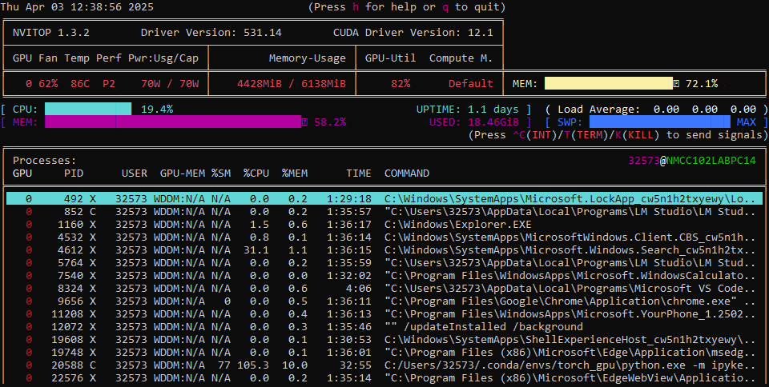

tags : #Odo
# **YOLO-based Object Detection with CN-OCR Integration** 🚀

## **Overview**

This project implements **YOLO-based object detection** to detect **Odometer and LCD** components in images. It also integrates **CN-OCR** for extracting text from detected objects. A **Streamlit-based UI** is provided for seamless interaction.

### **Key Features**

👉 **YOLO-based object detection** (fine-tuned on a custom dataset)  
👉 **CN-OCR integration** for text recognition  
👉 **Streamlit UI** for easy interaction  
👉 **GPU-accelerated training** with CUDA 12.1

---

## **Project Structure**

```
/your-repo
  ├── data_formation.ipynb   # Dataset preparation
  ├── model_training.ipynb   # Training YOLO on custom data
  ├── model_evaluation.ipynb # Evaluating model performance
  ├── main_task.py           # Streamlit UI for detection & OCR
  ├── requirements.txt       # Dependencies
  ├── data.yaml              # YOLO dataset configuration
  ├── README.md              # Project documentation
  ├── datasets/              # Folder containing training/validation data
  └── runs/                  # Stores trained models and logs
```

---

## **Installation**

### **Clone the Repository**

```bash
git clone https://github.com/Sheel09/Odometer-Reading.git
cd Odometer-Reading
```

### **Install Dependencies**

#### **For GPU Users (CUDA 12.1)**

```bash
pip install -r requirements.txt
pip install torch torchvision torchaudio --index-url https://download.pytorch.org/whl/cu121
```

#### **For CPU Users**

```bash
pip install -r requirements.txt
```

---

## **Dataset Setup**

Ensure your dataset follows this structure:

```
/datasets
  ├── train
  │     ├── images
  │     ├── labels
  ├── val
  │     ├── images
  │     └── labels
```

Modify `dataset.yaml` accordingly:

```yaml
train: datasets/train/images
val: datasets/val/images

nc: 2
names: ["Odometer", "LCD"]
```

To process and format your dataset, run:  
👉 [**Model_Formation.ipynb**](Model_Formation.ipynb) (to convert dataset to yolo format) 

---

## **Training the Model**

👉 [**Model_Training.ipynb**](Model_Training.ipynb)   (Use this notebook to train your own model) 

---
## **Evaluating the Model**

👉 [**Model_Evaluation.ipynb**](Model_Evaluation.ipynb)   (Use this notebook to evaluate and test the model) 

---
## **Launching the Streamlit UI**

To use the web-based UI for detection & OCR:

```bash
streamlit run odometer_reading.py
```
## **System utilization**


## **Streamlit Demo**


## **YOLO Model For odometer Detection**
[YOLO Model](runs/custom_train/best.pt)
